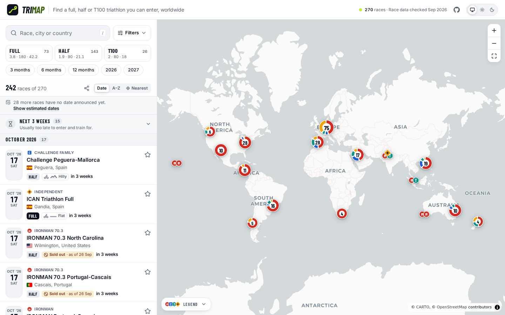
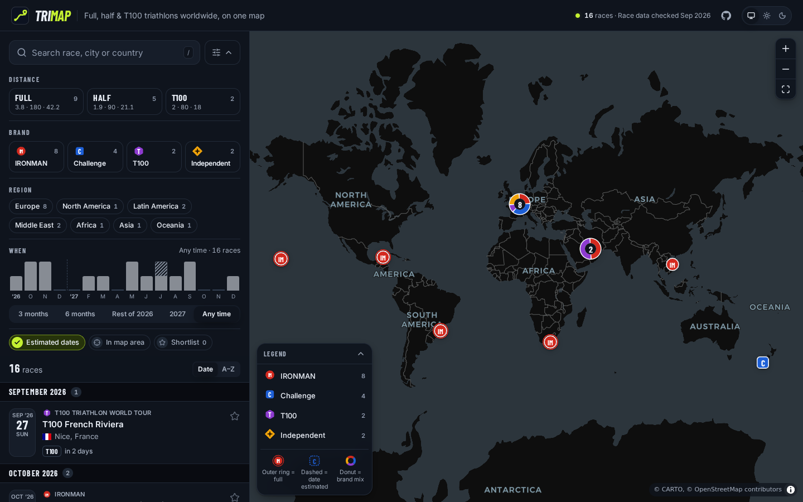
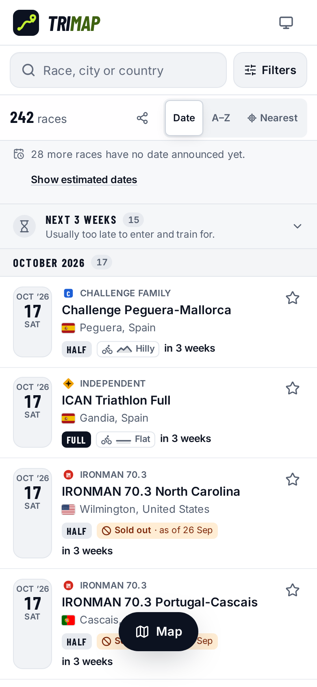
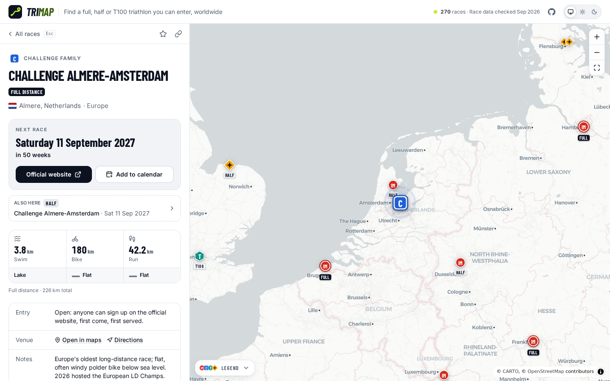

# TriMap

**Find your next long-distance triathlon to enter.** TriMap is built for age-group
athletes choosing their next race, not for following pro racing. It puts every IRONMAN,
IRONMAN 70.3, Challenge Family, T100 and notable independent full- and half-distance race
that age-groupers can race on one world map, searchable in seconds by **distance**,
**date**, **region**, **how you get a start** and **how hilly the course is**.

It is a fully static site (no backend, no API keys) built for GitHub Pages.



| Dark theme                                       | Mobile                                      | Race detail                                         |
| ------------------------------------------------ | ------------------------------------------- | --------------------------------------------------- |
|  |  |  |

_These screenshots show the real race data (September 2026). `npm run screenshots`
regenerates every image in `docs/screenshots` from the small fixture set in
`tests/fixtures/races` instead._

## Features

- **World map with brand markers.** Each brand has its own original glyph: shape, colour
  _and_ monogram, so it stays readable for colour-blind users and in greyscale
  (IRONMAN: red circle "IM", Challenge: blue rounded square "C", T100: teal hexagon
  "T", Independent: amber diamond with a spark). Full-distance races get an outer ring,
  races whose date is only estimated (when estimated dates are on) are drawn hollow with
  a dashed outline,
  qualifier-only and ballot races carry a small lock / ticket pip, a few races close
  together fan out their own glyphs and bigger clusters are donuts showing the brand
  mix. A FULL / HALF / T100 tag, like the card badge, appears when you zoom in.
- **The filters you need first stay in view.** Search, distance and date presets sit
  above the results; region, course, entry options and brand open under **Filters**,
  and while it is closed the filters set there show as removable chips.
- **Filters that combine:** free-text search (accent- and case-insensitive, word starts,
  common country names such as "USA" or "UK", a year such as "roth 2027"; press `/`),
  distance (Full 3.8/180/42.2, Half 1.9/90/21.1, T100 2/80/18), brand (chips and the
  map legend share one state), region, and a **month histogram** you can click or drag
  across, with presets (3, 6 and 12 months, rest of this year, next year).
- **Planning next season works.** A date range matches a race when any upcoming
  edition with an announced date falls in it, so "2027" also finds races whose next
  edition is in late 2026; the card shows the 2027 date with "(next: Dec 2026)". With
  **Estimated dates** on, projected editions count too, and the list says how many
  races usually held in that period have no date announced yet.
- **Can I just sign up?** Races that need a qualifying slot carry a "Qualifier only"
  badge, lottery/application races a "Ballot" badge (on cards, in the detail and in the
  map tooltip). **Open entry only** hides both.
- **Course profile.** Bike and run courses are rated Flat / Rolling / Hilly /
  Mountainous and shown with a small elevation silhouette and the word. The **Course**
  filter picks profiles per discipline; races without course data are left out while
  it is active, and the list says how many that hid and can list them.
- **Nearest first.** Sort by distance from your location (asked for only when you pick
  "Nearest"), or from the map centre (marked on the map) if you don't share it; cards
  then show "1,240 km away".
- **Countdown in weeks** up to a year out ("in 23 weeks"), because training plans are
  counted in weeks. Races in the next three weeks, usually too late to enter and train
  for, start folded away.
- **Races that change hands.** When a race continues under another name (for example a
  Challenge half that becomes a T100 Challenger event), its page says "Continues as …
  from 2027" and the new race says "Formerly …"; searching the old name finds the new
  race. Races with no future edition are not listed, but links to them still open with
  a clear "No future edition announced".
- **Age-grouper emphasis.** A championship title is prominent only when you have to
  qualify for it; regional titles and pro tour finals held alongside an open race are a
  quiet secondary tag. T100 races read "T100 · 100 km"; cards name what you enter
  ("T100", "T100 Challenger") and the detail names the series.
- **Only announced dates by default.** Every date shown by default comes from an
  official source. A race whose next date is not announced yet is left out of the
  list, map and counts (the list says how many), and its page says "Next date not
  announced yet · last held …". Turn on **Estimated dates** (`?est=1`) to see an
  estimate from the last edition (same month, weekday and week of the month), labelled
  "≈ Jul 2027 · date TBA".
- **Near-standard distances.** A race held over official distances more than 5% off
  its category's standard on some leg (Celtman: 3.4 / 202 / 41 km) shows those numbers
  and a "Non-standard distance" tag on the card, in the detail and in the map tooltip.
  The distance filter still works by category.
- **Only in map area**, a **shortlist** (stars, stored in your browser; shortlisted
  cards spell out swim, bike and run for comparing), sort by date or name, sticky month
  headers, and an empty state that tells you which filter to relax.
- **Shareable URLs.** Every filter, the sort and the open race live in the query string
  (`?dist=full&region=europe&when=6m&open=1&bike=flat,rolling&sort=near&race=challenge-roth-full`),
  including the map area of an "In map area" search (`bbox=west,south,east,north`), so
  a link made on a desktop shows the same races on a phone. A race's "Copy link" points
  at a small page per race whose preview names the race in chat apps.
- **Race detail** with swim/bike/run distances, swim type and bike/run profiles, how to
  enter, championship, countdown, all known editions, venue, notes, sources, **Add to
  calendar** (.ics, all-day), copy link, and a "Report a correction" link that
  pre-fills a GitHub issue.
- **Works without the map.** If the map cannot load (no WebGL 2, a failed download),
  the list, filters and race details keep working.
- Light/dark/system theme (the basemap follows), keyboard navigation with a skip link,
  visible focus, `prefers-reduced-motion`, WCAG AA contrast (checked with axe in the
  e2e suite), 44px touch targets on touch screens (phones and tablets).

## Quick start

Requires Node 22+.

```bash
npm ci
npm run dev             # http://localhost:5173 with the real data in data/races
npm run dev:fixtures    # same, with the 19-race fixture set (tests/fixtures/races)
```

## Scripts

| Script                                  | What it does                                                                       |
| --------------------------------------- | ---------------------------------------------------------------------------------- |
| `npm run dev` / `dev:fixtures`          | Vite dev server with real / fixture data                                           |
| `npm run build`                         | Production build into `dist/` (fails on invalid race data)                         |
| `npm run build:fixtures`                | Build with fixture data into `dist-fixtures/` (used by e2e)                        |
| `npm run preview`                       | Serve `dist/` locally                                                              |
| `npm run validate:data`                 | Validate `data/races/*.json` and print a summary; `-- --fixtures` for the fixtures |
| `npm test`                              | Unit tests (Vitest)                                                                |
| `npm run test:e2e`                      | Playwright smoke + accessibility tests against a fixture build                     |
| `npm run screenshots`                   | Regenerate `docs/screenshots/*.png`                                                |
| `npm run typecheck` / `lint` / `format` | TypeScript, ESLint, Prettier                                                       |

For the e2e tests install Chromium once with `npx playwright install chromium` (on a bare
Linux box also `npx playwright install-deps chromium`).

## Race data

All races live in `data/races/*.json`, one file per brand/region (see
[`data/README.md`](data/README.md) for the full contract). One record is one race at one
distance at one venue:

```json
{
  "id": "ironman-frankfurt-full",
  "name": "IRONMAN Frankfurt",
  "brand": "ironman",
  "series": "IRONMAN",
  "distance": "full",
  "championship": "IRONMAN European Championship",
  "city": "Frankfurt am Main",
  "country": "DE",
  "lat": 50.1109,
  "lng": 8.6821,
  "url": "https://www.ironman.com/races/im-frankfurt",
  "editions": [{ "date": "2027-06-27", "status": "confirmed" }],
  "swim": "lake",
  "bike": "rolling",
  "run": "flat",
  "entry": "open",
  "sources": ["https://www.ironman.com/races/im-frankfurt"],
  "verifiedAt": "2026-09-25"
}
```

Everything describes the **age-group** race: its date, its entry (`open`,
`qualification` or `ballot`) and its course. `recurring: false` and `continuedAs` tell
the app not to guess a next edition for one-off or replaced races.

### Updating data

1. Edit the right file in `data/races/`: add a new edition to `editions` (keep them
   sorted), mark cancellations with `"status": "cancelled"`, and bump `verifiedAt`.
2. Run `npm run validate:data`. It checks the schema, unique ids across files, the id
   format (`<brand>-<location>-<distance>`), sorted editions, known country codes,
   coordinates inside the country's region (catches flipped signs), https URLs, and
   prints counts per brand × distance × region. Errors exit non-zero; warnings (for
   example "next date is estimated", or a missing bike / run course profile, which
   hides the race from course searches) do not.
3. Open a pull request. CI runs the same checks, and the production build refuses
   invalid data too, so a broken file cannot be deployed.

Countries and regions are defined in `src/data/regions.ts`; add a country there if the
validator reports an unknown code.

## Deploying to GitHub Pages

1. Push this repository to GitHub.
2. In **Settings → Pages**, set **Source** to **GitHub Actions**.
3. Push to `main`. `.github/workflows/deploy.yml` runs `npm ci`, `validate:data`,
   `typecheck`, `test`, `build`, and deploys `dist/` with `actions/deploy-pages`.

The workflow also runs every Monday at 05:00 UTC. The per-race share pages
(`race/<id>/`) and their "next date" text are written at build time, so the weekly
rebuild keeps them current between pushes. GitHub pauses scheduled workflows in a
repository with no activity for 60 days; re-enable it under **Actions** if that happens.

The build uses `base: './'`, so it works under any Pages sub-path
(`https://<user>.github.io/<repo>/`). The GitHub link in the header and the "Report a
correction" links are derived from the repository automatically in Actions; set
`VITE_REPO_URL` to override it (for example for a local build). Share previews need the
site's absolute URL: it defaults to the repository's GitHub Pages URL; set
`VITE_SITE_URL` for a custom domain.

Pull requests run `.github/workflows/ci.yml` (checks, build and the e2e suite) without
deploying.

## How it is built

- Vite + React 19 + TypeScript (strict), Tailwind CSS v4, self-hosted fonts (Barlow
  Condensed for display, Inter for UI).
- `maplibre-gl` used directly and lazy-loaded, so the results list renders before the
  map arrives (on phones only when the map is needed). Basemaps: CARTO Positron / Dark
  Matter (keyless). If a basemap style cannot load (also on a theme switch), the map
  falls back to a plain background and still shows every race.
- Races are a clustered GeoJSON source; clusters and races are HTML markers synced from
  the source, so they can use SVG glyphs and donuts.
- Data is read and validated with zod at build time (the `virtual:trimap-races`
  module in `vite.config.ts`), so the browser gets validated records and no schema
  library, and is enriched at runtime with region, country and the upcoming editions
  (`src/data/derive.ts`, `src/data/nextEdition.ts`).
- The build also writes `race/<id>/index.html` for every race (share previews, see
  `scripts/racePages.ts`) and injects absolute `og:image` / `og:url` / canonical tags
  when the site URL is known (`VITE_SITE_URL`, else the GitHub Pages URL of the repo).
  `public/og-image.png` and the app icons are static files.
- Flags are SVGs from [`flag-icons`](https://github.com/lipis/flag-icons) because
  Windows does not render flag emoji; the heaviest ones (coats of arms) are small PNGs
  in `src/assets/flags`.

```
src/
  data/        schema (zod), derivation, regions, brands + glyphs, next-edition logic, loader, validator
  lib/         filters, URL state, dates, geo, .ics, search
  components/  header, filters, time histogram, results list, race detail, sheets
  map/         MapView (lazy), marker builders, legend
scripts/       validate-data.ts, racePages.ts (per-race share pages)
tests/         unit tests + fixture races
e2e/           Playwright smoke, accessibility and screenshot specs
```

## Disclaimer

TriMap is not affiliated with IRONMAN, Challenge Family or PTO/T100. Brand glyphs are
original monograms, not the organisers' logos. Dates can change; always confirm on the
official website.
